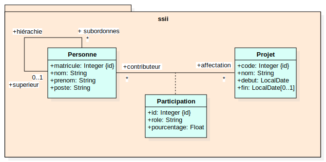

# Organisation des projets - Spring JPA

## Table des matières
- [Description](#description)
- [Prérequis](#prérequis)
- [Installation](#installation)
- [Exercice](#exercice)

## Description
Cet exercice présente une version simplifiée de l'exercice "organisation des projets" traité en UML au 1° semestre.

Le modèle conceptuel (UML) de la base de données est illustré en Figure 1 :



*Figure 1 : Modèle conceptuel de la base de données*

## Prérequis
- Java 21
- Maven

## Installation
Clonez le dépôt et naviguez dans le répertoire du projet :
```bash
git clone https://github.com/bastide/ssii-spring-jpa.git
cd ssii-spring-jpa
mvn clean spring-boot:run
```
Ouvrir l'application web sur [http://localhost:8989](http://localhost:8989)
## Exercice

1) Mettre en œuvre ce modèle en utilisant Spring Data JPA (entités et repositories) en respectant au mieux le modèle conceptuel.
2) Initialiser la base de données en ajoutant quelques enregistrements pour chaque table dans [`data.sql`](./src/main/resources/data.sql).
3) Mettre en œuvre un service métier qui enregistre la participation d'une personne (connue par son matricule) à un projet (connu par son code)
en précisant son rôle et le pourcentage de son temps qu'il consacre à ce projet. 
Ce service doit respecter les règles de gestion suivantes :
   1) Une personne ne peut pas participer plusieurs fois au même projet.
   2) Une personne ne peut pas être occupée à plus de 100% sur des projets en cours.
   3) Une personne ne peut pas participer à plus de trois projets en même temps.
4) Écrire des tests unitaires qui vérifient les règles métier ci-dessus.
